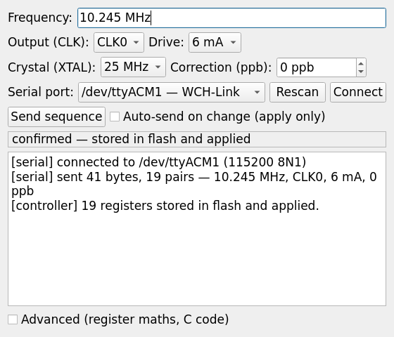

# si5351-xtal — a programmable crystal replacement

Odd crystal frequencies are hard to buy and expensive to have cut. This turns a
**CH32V003** (a ~$0.30 RISC-V microcontroller in an 8-pin SOP) plus any of the
common **Si5351A** breakout boards into a drop-in replacement: set the frequency
once over USB, and the board comes up on that frequency every time it is
powered, with no PC attached.

Typical uses: a 10.245 MHz IF crystal, an 11.0592 MHz baud-rate clock, a
3.579545 MHz colour burst, a 24.576 MHz audio master clock — anything the
shop does not stock.



## What it can do

| | |
|---|---|
| Range | **3.907 kHz – 133.333 MHz** (the tool refuses anything outside it) |
| Accuracy | **better than 0.05 ppm** — measured across 14 typical frequencies, worst case 0.044 ppm |
| Outputs | CLK0–CLK7, drive strength 2 / 4 / 6 / 8 mA |
| Reference | 25 MHz or 27 MHz crystal, with a ppb correction you can trim against a counter |
| Persistence | the setting is stored in the MCU's flash and restored on power-up |

The accuracy is roughly a thousand times better than the tolerance of the
crystal being replaced (typically ±20–50 ppm), so the synthesis is never the
limiting factor.

## Quick start

1. Download `si5351-tool` (Linux) or `si5351-tool.exe` (Windows) from
   [Releases](../../releases). No Python, no installation — one file.
2. Flash `src/main.cpp` to the CH32V003 with a WCH-LinkE
   (`pio run -t upload`). This is a one-off.
3. Wire it up (below), plug a USB-serial adapter in, run the tool.
4. Type the frequency — `10.245 MHz`, `32.768k` and `3579545` are all accepted
   — pick the output and the board's crystal, then press **Send sequence**.

The controller replies, so the tool tells you in plain words whether it worked
or whether the Si5351 is not answering.

To trim the frequency against a counter, tick **Auto-send on change**, turn the
**Correction (ppb)** spinner until the reading matches, then press **Send
sequence** once to commit. Auto-send deliberately does not write to flash, so
tuning costs no write cycles.

## Wiring (CH32V003J4M6, SOP-8)

Several die pads share one physical pin on this package, which constrains the
layout more than the pin count suggests:

| Pin | Signal | Connect to |
|---|---|---|
| 1 | PD6 | serial adapter **TX** |
| 2 | VSS | ground |
| 3 | PA2 | — |
| 4 | VDD | 3.3 V |
| 5 | PC1 / SDA | Si5351 **SDA** |
| 6 | PC2 / SCL | Si5351 **SCL** |
| 7 | PC4 | serial adapter **RX** |
| 8 | PD1 / SWIO | WCH-LinkE **SWDIO** (programming only) |

Do not forget I²C pull-up resistors on SDA and SCL if your Si5351 board has
none. A WCH-LinkE can supply all of it — 3.3 V, ground, SWDIO and its own
serial port — on one cable.

## Notes worth knowing

Getting this working turned up several things that are not obvious and that
cost real debugging time. They are documented in [tools/README.md](tools/README.md):

- On the Arduino core for this chip, `TwoWire::endTransmission()` returns
  success whether or not the slave acknowledged, and returns an error for an
  empty transmission — which is exactly the presence check the Etherkit Si5351
  library performs. The library therefore *always* concludes the chip is absent
  and skips its entire initialisation. This firmware drives I²C itself.
- The core's I²C helpers wait on every flag with an unbounded loop, so a
  miswired device hangs the firmware before it ever reaches `loop()`. Every
  wait here is bounded, NAK is reported honestly, and a stuck bus is recovered.
- **Pin 8 carries both SWIO and the hardware UART TX.** The moment firmware
  configures that TX, the debug probe can no longer reach the chip and recovery
  needs a power-cycle unbrick that erases the flash. The UART here receives on
  PD6 and transmits from a bit-banged pin instead, so SWIO stays usable.
- Flash can only be erased and programmed through the real `0x08000000`
  mapping. Writes aimed at the `0x00000000` execution alias are silently
  ignored — they appear to succeed and do nothing.

## Building

```bash
# firmware
pio run -t upload

# the tool, as a single-file executable
./tools/build_app.sh linux
./tools/build_app.sh windows     # runs in a Wine container; needs docker
```

CI builds both natively on every tag and attaches them to the release.

## Authors

- **freetoair (YT1BN)** — idea, hardware, and every measurement that decided
  whether something actually worked.
- **[Claude Code](https://claude.com/claude-code)** (Anthropic) — firmware and
  tooling, and the debugging behind the notes above.

## Licence

Copyright (C) 2026 freetoair (YT1BN).

GPL v3 or later — see [LICENSE](LICENSE).

`tools/si5351_gen.py` is a Python port of the register maths from the
[Etherkit Si5351 library](https://github.com/etherkit/Si5351Arduino) by Jason
Milldrum NT7S, which is GPL v3; this project inherits that licence.
